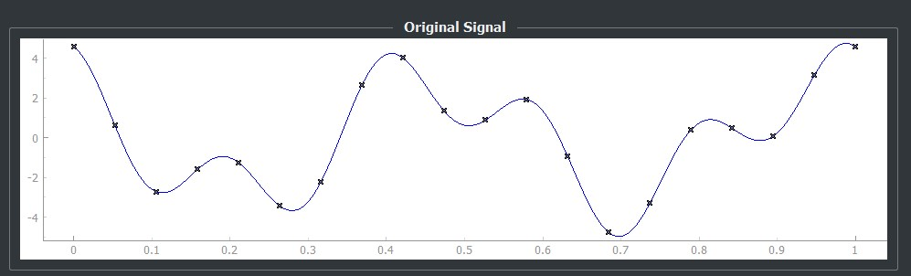
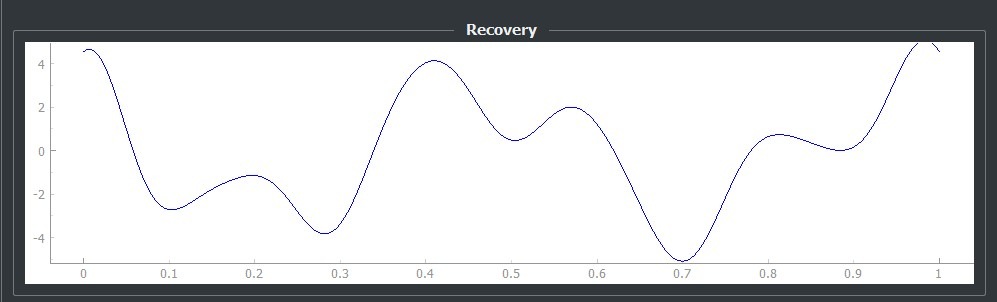
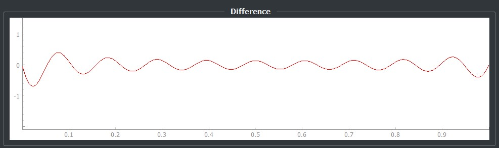
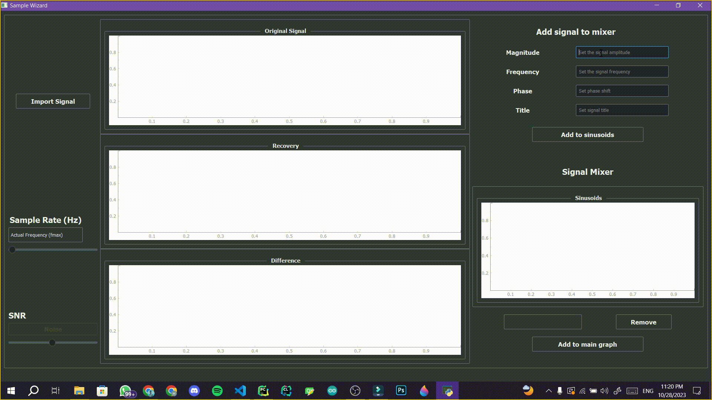
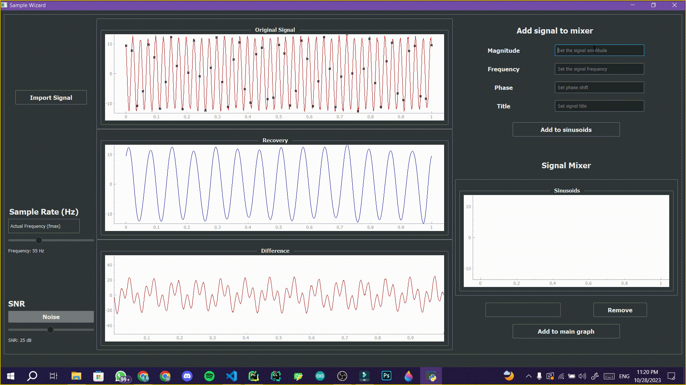

# Sample Wizard

This project is a digital signal processing application that allows users to sample and recover input signals, load and compose signals, add noise, and visualize different aspects of signal processing. The application includes the following features:

## Features

### 1. Sample & Recover

- Load a mid-length signal (around 1000 points) and sample it at various frequencies.

- Use Whittaker–Shannon interpolation formula to recover the original signal.

- Display the original signal with sampled points, the reconstructed signal, and the difference between them.

### 2. Load & Compose

- Load signals from a file or create composite signals with multiple sinusoidal components.

- Customize the frequencies and magnitudes of sinusoidal components using mixer.

- Remove or modify components during signal composition.

### 3. Additive Noise

- Add noise to the loaded signal with a controllable Signal-to-Noise Ratio (SNR).

- Observe how noise affects the signal, including its dependency on the signal frequency.

## Contributors

- [Ziyad ElFayoumy](https://github.com/Ziyad-HF)
- [Amgad Atef](https://github.com/amg-eng)
- [Mahmoud Mohamed](https://github.com/Mahmoudm007)
